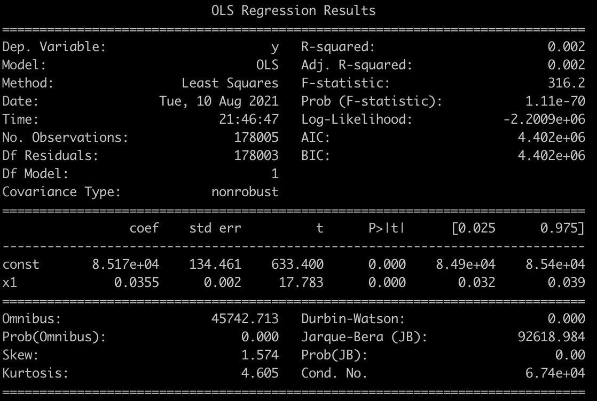

# COVID-19, Subway Ridership, and Income in New York City
### [John Wu](https://github.com/JohnUUU), [Kazen Gallman](https://github.com/kazar4), and [Michael Kearney](https://github.com/michaelandrewkearney)

## Background

COVID-19 has had a dramatic impact on many daily aspects of life, including public transportation. We want to investigate how big that impact was, and how the impact can be different for different groups of people.

We believe that the second wave of COVID-19 reduced subway ridership across the city, but wanted to explore the ways in which the impact might be different in different neighborhoods. People in different neighborhoods have unequal incomes, different types of jobs, unequal benefits (like sick leave or the ability to work from home), and unequal access to resources (for example, to food delivery or private transportation).

Our goal is to gain insight on how COVID-19 has affected people in New York City and how specific communities may have been affected differently.

This was a final project for a Data Science course at Brown University in Summer 2021.

## Questions

1. Is there a significant change in year-over-year ridership on the New York City subways during the second wave of the COVID-19 Virus?
2. Is there a significant relationship between the degree of ridership change at subway stations and the mean income of the zip codes they are located in?
3. Is there a significant relationship between COVID-19 caserates in New York City zip codes and the mean incomes of those zip codes?

## Data Sources

- [MTA](new.mta.info/):
  - Turnstile counter data from the MTA by Subunit Channel Position
  - Remote Unit/Control Area/Station Name Key
  - Station and Station Complex Key (with coordinates)
  - Remote Unit to Station Complex Key (compiled manually)
- [NYC Open Data](data.cityofnewyork.us/Health/Modified-Zip-Code-Tabulation-Areas-MODZCTA-/pri4-ifjk/data?no_mobile=true)
  - MODZCTA Shapefiles
- [NYC Health](github.com/nychealth/coronavirus-data)
  - COVID Weekly Caserate by MODZCTA
- [Citizen's Committee for Children of New York](data.cccnewyork.org/data/table/66/median-incomes#66/107/62/a/a)
  - Income Data


## Analysis


Null Hypothesis: There is not a significant difference between the % Difference of Turnstile Usage during the second wave of COVID-19 and the % Difference of Turnstile Usage before the second wave of COVID-19 , with an alpha level of 0.05

Alternative Hypothesis: There is a significant difference between % Difference of Turnstile Usage during the second wave of COVID-19 and the % Difference of Turnstile Usage before the second wave of COVID-19, with an alpha level of 0.05

### Paired T-Test

Percent Difference of Turnstile Usage During Second Wave vs Before with a Train-Test Split of 0.8-0.2

Training Data:
```
Test Statistics: [8.80262789]
p-value: [1.4479604e-18]
p-value < 0.05 [True]
```

Testing Data:
```
Test Statistics: [5.44932574]
p-value: [5.24504623e-08]
p-value < 0.05 [True]
```

For both the training and testing data, the p-value was less than the alpha level of 0.05, so we can reject the null hypothesis. There *is* a statistically  significant relationship between the Weekly Covid Caserate and the % Difference of Turnstile Usage during the second wave of COVID-19  

### P-Value by Zip Code


White spaces on the map indicate regions where not enough turnstile information could be collected to run an statistical analysis on that zip code.  

### Ridership Changes by Zip Code




### COVID-19 Caserates and Income by Zip Code


## Conclusion

The second wave of COVID-19 significantly affected subway ridership in New York City. Median income and COVID-19 caserates also affected subway ridership, but not as much as originally expected. More analysis that includes other demographic information such as family size, type of job, and commute distance could be useful to examine the affect of COVID-19 on transportation patterns for difference populations.
